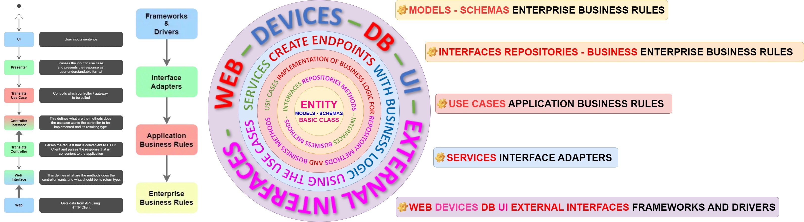

# https://emojipedia.org
# https://gist.github.com/rxaviers/7360908
Repository with projects especially focused on Computer Science and Natural Sciences.


# 🐍 SCAFFOLDING FOR CLEAN ARCHITECTURE IN MICROSERVICES

```
📦jorge_cardona_project [project_directory]
┗ 📂deployment [package]
┗ 📂requirements [package]
┗ 📂test [package]
┗ 📜 README.md
┗ ⚠️ .gitignore
┗ 📂application [package]
┃ ┣ 📂configuration
┃ ┣ 📂log
┃ ┣ 📂htmlcov
┃ ┣ 📂utils
┃ ┣ 📂domain [package]
┃ ┃ ┣ 📂entities [package]
┃ ┃ ┣ 📂interfaces [package]
┃ ┃ ┃ ┗ 📂repositories [package]
┃ ┃ ┃ ┗ 📂business_logic [package]
┃ ┃ ┣ 📂usecases [package]
┃ ┃ ┣ 📂services [package]
┃ ┣ main.py [__main__]
```

# PROJECT PACKAGES STRUCTURE
```
📦jorge_cardona_project [project_directory]
┗ 📂application [package]
┃ ┣ 🎄 main.py [__main__]
┃ ┣ 📂configuration
┃ ┣ ┗ 📂 rest
┃ ┃ ┣ ┗ 🏩 app_configuration.py
┃ ┣ ┗ 📂 environment
┃ ┃ ┣ ┗ 📡 environment_configuration.py
┃ ┣ ┗ 📂  database
┃ ┃ ┣ ┗ 🔑 database_configuration.py
┃ ┣ ┗ 📂 log
┃ ┃ ┣ ┗ 📜 log_configuration.py
┃ ┣ ┗ 📂 cors
┃ ┃ ┣ ┗ 🚧 cors_configuration.py
┃ ┣ ┗ 📂 swagger
┃ ┃ ┣ ┗ 📪 swagger_configuration.py
┃ ┣ 📂log
┃ ┣ ┗ 💬 logging.log
┃ ┣ 📂htmlcov
┃ ┣ ┗ 📜 main_py.html
┃ ┣ 📂utils
┃ ┣ ┗ 🐍 script.py
┃ ┣ ┗ 🎰 file.yaml
┃ ┣ ┗ 📜 image.jpg
┃ ┣ 📂domain [package]
┃ ┃ ┣ 📂entities [package]
┃ ┃ ┃ ┣ 📂entity_one
┃ ┃ ┃ ┃ ┗ 🐍 model_for_entity_ONE.py
┃ ┃ ┃ ┃ ┗ 💦 schema_for_entity_ONE.py
┃ ┃ ┃ ┣ 📂entity_two
┃ ┃ ┃ ┃ ┗ 🐍 model_for_entity_TWO.py
┃ ┃ ┃ ┃ ┗ 💦 schema_for_entity_TWO.py
┃ ┃ ┃ ┣ 📂entity_n
┃ ┃ ┃ ┃ ┗ 🐍 model_for_entity_N.py
┃ ┃ ┃ ┃ ┗ 💦 schema_for_entity_N.py
┃ ┃ ┣ 📂interfaces [package]
┃ ┃ ┃ ┗ 📂repositories [package]
┃ ┃ ┃ ┃ ┃ ┗ 🐟 database_method_model_Entity_ONE.py
┃ ┃ ┃ ┃ ┃ ┗ 🐟 database_method_model_Entity_TWO.py
┃ ┃ ┃ ┃ ┃ ┗ 🐟 database_method_model_Entity_N.py
┃ ┃ ┃ ┗ 📂business_logic [package]
┃ ┃ ┃ ┃ ┃ ┗ 🐦 business_logic_method_model_Entity_ONE.py
┃ ┃ ┃ ┃ ┃ ┗ 🐦 business_logic_method_model_Entity_TWO.py
┃ ┃ ┃ ┃ ┃ ┗ 🐦 business_logic_method_model_Entity_N.py
┃ ┃ ┣ 📂usecases [package]
┃ ┃ ┃ ┃ ┗ 🎎 use_case_implementation_business_repository_logic_model_ONE.py
┃ ┃ ┃ ┃ ┗ 🎎 use_case_implementation_business_repository_logic_model_TWO.py
┃ ┃ ┃ ┃ ┗ 🎎 use_case_implementation_business_repository_logic_model_N.py
┃ ┃ ┣ 📂services [package]
┃ ┃ ┃ ┃ ┗ ✈️ services_use_case_implementation_model_ONE.py
┃ ┃ ┃ ┃ ┗ ✈️ services_use_case_implementation_model_TWO.py
┃ ┃ ┃ ┃ ┗ ✈️ services_use_case_implementation_model_N.py
┗ 📂deployment [package]
┃ ┗ 🐳 Dockerfile
┃ ┗ 🎰 Manifest.yaml
┗ 📂requirements [package]
┃ ┗ 📄 requirements.txt
┗ 📂test [package]
┃ ┃ ┣ 📂test_case_one
┃ ┃ ┃ ┗ 🍄 use_case_implementation_one.py
┃ ┃ ┃ ┗ 🍄 services_use_case_implementation_one.py
┃ ┃ ┣ 📂test_case_two
┃ ┃ ┃ ┗ 🍄 use_case_implementation_two.py
┃ ┃ ┃ ┗ 🍄 services_use_case_implementation_two.py
┃ ┃ ┣ 📂test_case_n
┃ ┃ ┃ ┗ 🍄 use_case_implementation_n.py
┃ ┃ ┃ ┗ 🍄 services_use_case_implementation_n.py
┗ 📜 README.md
┗ ⚠️ .gitignore
```

# Application
Directory that contains the packages with the application code.

# Configuration
Contains all configuration files for the Application

# Log
Save information about the application log.

# htmlcov
Save unit testing coverage information about the application code.

# Utils
Contains transversal resources for the application, that is not possible to include in other layers.

# Entities
is a package that contains modules, like Models and Schemas, the module it's a plain script, it contains only the class definition and no logic in the classes.
- **Models**: are modules that contain the fields from a table on the database and it is represented by a class.
- **Schemas**: these are modules that contain the fields Used to validate data we receive as well as to reformat the data that we want to send to the client/browser, so just contains the fields that we want to return in the request.

# Interfaces
are interfaces that contain only the methods that need to be implemented in the use cases one directory by class.
- **Repository**: Contains modules with methods that are needed to communicate with the database by class.
- **Business**: Contains modules with methods that are needed to process the information by class.

# Use Cases
is a package that contains modules, the module is a class that implements the methods from the package interfaces(Repository, Business) and defines the business logic by module.

# Services
is a package that contains modules, the module is a class that contains the API services by functionality or by class and use the UseCases classes.

# Web, Devices, DB, UI, External Interfaces
layer that communicates internal API services with API consumers.

# Deployment
Directory that contains the Dockerfile, k8s Manifest, and every file needed for the deployment.

# Requirements
Directory containing the requirements.txt with the definition of project dependencies.

# Test
Directory that contains the unit testing from the Use Cases and Services files.
